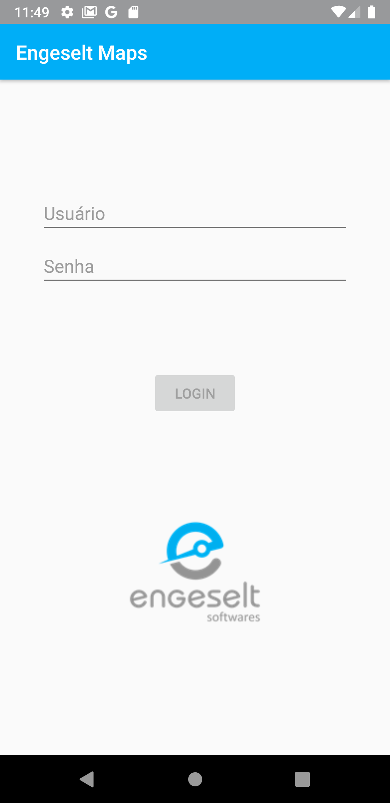
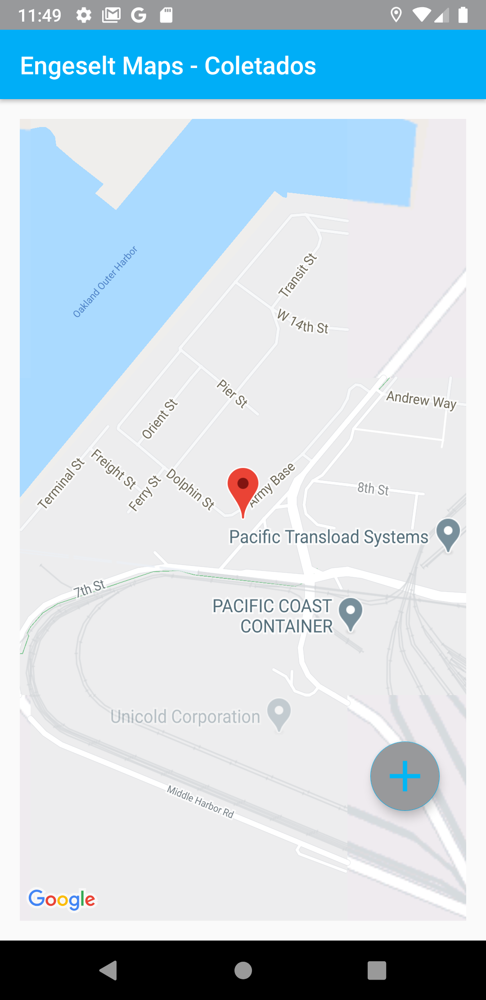
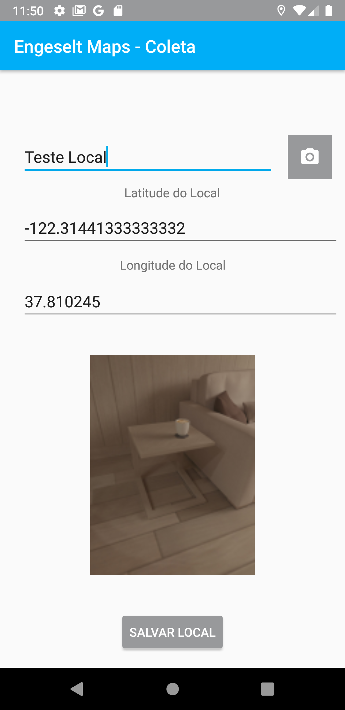
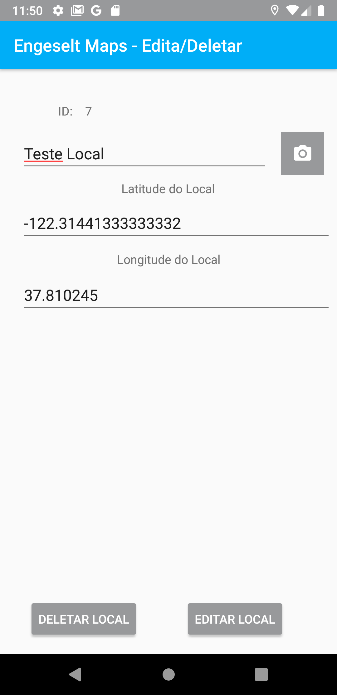

# Desafio Engeselt Software

## Detalhamento do desafio

Foi elaborado um App em Kotlin com desenvolvimento Android, telas apresentadas a seguir:

## Algumas Informações:

- Tela de login livre, com detalhe de usuário não permitindo email e senha mais de 6 caracteres;
- Banco de dados utilizando SQLite por ser bastante simples;
- Para tela de Editar/Deletar, clicar na marcar presente no mapa, caso clique na marcar na qual você está localizado é informado.

## Serviços Solicitados:

- O usuário deverá realizar o login no app preenchendo os campos login e senha e pressionar o botão entrar;
- Ao realizar o login será mostrado um mapa onde será exibido todos os pontos coletados;
- Ao pressionar no botão flutuante “+” o app deverá coletar a posição geográfica do dispositivo e abri um formulário de cadastro com os campos: Nome do Ponto, Latitude e Longitude;
- No formulário de cadastro deverá ser possível realizar também o registro fotográfico do ponto coletado;
- Ao salvar os dados, o mapa deverá atualizar e exibir todos os pontos coletado;
- O usuário deverá ser capaz de editar e excluir os pontos existentes.
